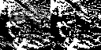
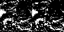

# Cloud Nowcasting

## Introduction

This project aims to predict the current and near-future cloud coverage over a set area taking input from the very recent past. It use deep learning (specifically a ConvLSTM) model. The use cases of this project can stem from weather prediction, to solar irradience graphing.

## Table of Contents

- [Cloud Nowcasting](#Cloud-Nowcasting)
  - [Introduction](#introduction)
  - [Table of Contents](#table-of-contents)
  - [Project Overview](#project-overview)
  - [Key Features](#key-features)
  - [Data Collection](#data-collection)
  - [Training](#Training)
  - [Prediction Visualizations](#findings-and-visualizations)
  - [License](#license)
  - [References](#References)

## Project Overview

Clouds remain a vital indicator of our environment and a strong variable in weather prediction. Clouds impact the amount of sunlight reaching the ground. This holds a strong impact on the [solar irradience](https://en.wikipedia.org/wiki/Solar_irradiance). Solar irradience is a major factor of solar panel efficacy [[1]](#1). Solar panel efficacy is extremely vital to place with non-robust power grids.

## A Focus on Puerto Rico

Specifically in this project the focus is on Puerto Rico. This is due to a couple of factors:
- Puerto Rico plans on decentralizing their grid using solar panels [[2]](#2).
- Puerto Rico suffers a large amount of power outages, multiple times a week [[3]](#3)

## Key Features

- **Data Collection/Processing:** This project utilizes data from the GOES-16 satellite. GOES-16 (Geostationary Operational Environmental Satellite-R Series), is a weather satellite operated by the National Oceanic and Atmospheric Administration (NOAA) and the National Aeronautics and Space Administration (NASA) in the United States. Launched on November 19, 2016, the GOES-16 is part of a new generation of geostationary weather satellites designed to provide more accurate and timely weather observations.
- **ConvLSTM:** This project predicts the output frame using a Convolutional LSTM. The implementation in this project is modified from Rohit Panda's [Video Frame Prediction using ConvLSTM Network in PyTorch](https://sladewinter.medium.com/video-frame-prediction-using-convlstm-network-in-pytorch-b5210a6ce582)
- **Data Visualization:** This project uses matplotlib to create visualizations that show the gif of ground truth vs. predicted frames.

## Data Collection

Data was collected from the google cloud [repository of data](https://console.cloud.google.com/storage/browser/gcp-public-data-goes-16/ABI-L2-ACMC;tab=objects?pageState=(%22StorageObjectListTable%22:(%22f%22:%22%255B%255D%22))&prefix=&forceOnObjectsSortingFiltering=false). It was downloaded using the google command line util, in accordance with the instructions on the website. Data was then placed into sequences of 20 frames and scaled down to 64x64 resolution (faster training) and exported to **.npy*. There seemed to be a memory leak issue with the NetCDF4 library when reading the *.nc* files. In this project it is resolved by doing half of the downloaded data at a time and then restarting the kernal. (See netcnf.ipynb for collection, processing, and exporting data)

## Findings and Visualizations

The comments inferenced were from two different NRA posts. The results are shown below.

The left side is the ground truth, and the right is the predicted. As you can see the predicted is very similar to the ground truth.

## License

This project operates under the terms of the [MIT License](LICENSE).

## References

[1] Lili Jin, Zhenjie Li, Qing He, Alim Abbas, "Variation in Surface Solar Radiation and the Influencing Factors in Xinjiang, Northwestern China", Advances in Meteorology, vol. 2022, Article ID 1999997, 13 pages, 2022. https://doi.org/10.1155/2022/1999997

[2] Bentley, C. (2023, September 17). Puerto Rico Hopes Solar Project Will Secure Electric Grid for future hurricanes. NPR. https://www.npr.org/2023/09/17/1200053507/puerto-rico-hopes-solar-project-will-secure-electric-grid-for-future-hurricanes 

[3] Acevedo, N. (n.d.). Amid power outages, Puerto Rico faces critical time on its Energy Future. NBCNews.com. https://www.nbcnews.com/news/latino/puerto-rico-blackouts-power-grid-ailing-renewable-energy-rcna68754 

The implementation in this project is modified from Rohit Panda's [Video Frame Prediction using ConvLSTM Network in PyTorch](https://sladewinter.medium.com/video-frame-prediction-using-convlstm-network-in-pytorch-b5210a6ce582)
